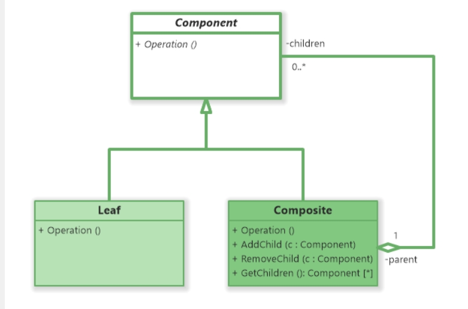

# Day 19｜Composite——菜單樹狀分類結構

昨天用 Proxy 幫會員點數查詢加了一層快取跟權限控制，今天我們繼續留在結構型 Pattern（Structural）

來聊聊 Composite 合成模式

原文的定義，一樣來自 Design Patterns: Elements of Reusable Object-Oriented Software

> Compose objects into tree structures to represent part-whole hierarchies. Composite lets clients treat individual objects and compositions of objects uniformly.

用中文理解可以是

> 把物件組合成樹狀結構，用來表示「部分-整體」的階層關係，讓客戶端可以用同一種方式，對待單一物件跟一堆物件組成的群組

我們來看看 UML 圖



核心角色

1. Component（共同介面）：Leaf 跟 Composite 都要實作的介面，定義一套「不管你是單一物件還是一堆物件，都該支援的操作」
2. Leaf（葉節點）：樹的最底層，沒有子節點，直接實作 Component 介面，處理自己的部分就好
3. Composite（組合節點）：本身也實作 Component 介面，但內部持有一份子節點清單（可能是一堆 Leaf，也可能還包著別的 Composite）。實作介面方法的方式通常是：對每一個子節點呼叫同一個方法，再往下遞迴

Client：只認識 Component 這個介面，不用判斷「我現在拿到的到底是單一物件還是一個群組」

呼叫方式完全一樣，遞迴的事交給樹自己處理

我們來舉例的情境:

電腦裡的檔案總管：資料夾底下可以放檔案，也可以放資料夾，資料夾裡面還能再包資料夾，一直往下疊

如果要算「這個資料夾佔多少容量」，你不會先去區分「這是檔案還是資料夾」再分開處理

你只會說「把這個節點的容量加起來」，至於它底下還有沒有子節點、疊了幾層，都是這個節點自己的事，不是你要操心的

我們來依據核心角色去做區分

```csharp
// 1. Component（共同介面）
public interface IFileSystemNode
{
    long GetSize();
}

// 2. Leaf（檔案：沒有子節點，直接回傳自己的大小）
public class FileNode : IFileSystemNode
{
    private readonly long _size;

    public FileNode(long size)
    {
        _size = size;
    }

    public long GetSize() => _size;
}

// 3. Composite（資料夾：內部持有一堆子節點，可能是檔案或者資料夾）
public class FolderNode : IFileSystemNode
{
    private readonly List<IFileSystemNode> _children = new();

    public void Add(IFileSystemNode node) => _children.Add(node);

    public long GetSize()
    {
        long total = 0;
        foreach (var child in _children)
        {
            total += child.GetSize(); // 不管子節點是檔案還是資料夾，呼叫方式完全一樣
        }
        return total;
    }
}
```

```csharp
var photo = new FileNode(300);
var video = new FileNode(1500);

var subFolder = new FolderNode();
subFolder.Add(video);

var rootFolder = new FolderNode();
rootFolder.Add(photo);
rootFolder.Add(subFolder); // 資料夾底下又包了一個資料夾

Console.WriteLine(rootFolder.GetSize()); // 1800，呼叫端完全不用管這棵樹疊了幾層
```

### 回到柴咖啡

柴咖啡展店之後，小黑在店裡加裝了一台電子看板，想讓客人一眼看清楚菜單分類：飲料底下再分冰的、熱的；點心底下再分鹹的、甜的，不要再像以前那樣，一張紙本菜單貼在收銀台後面，客人得瞇著眼睛自己找

阿柴目前資料庫裡的 `MenuItem`，長得很陽春，分類是塞在一個字串欄位裡

```csharp
public class MenuItem
{
    public string Name { get; set; }
    public int Price { get; set; }
    public string Category { get; set; } // 例如 "飲料-熱"、"點心-甜"
}
```

## 先看看阿柴趕工出來的版本

看板要趕在週末前上線，阿柴直接寫一個 `MenuPrinter`，把 `Category` 字串切開，兩層 `foreach` 分組印出來

```csharp
public class MenuPrinter
{
    public void PrintMenu(List<MenuItem> items)
    {
        var byBigCategory = items.GroupBy(i => i.Category.Split('-')[0]);

        foreach (var bigGroup in byBigCategory)
        {
            Console.WriteLine($"【{bigGroup.Key}】");

            var bySubCategory = bigGroup.GroupBy(i => i.Category.Split('-')[1]);
            foreach (var subGroup in bySubCategory)
            {
                Console.WriteLine($"  【{subGroup.Key}】");
                foreach (var item in subGroup)
                {
                    Console.WriteLine($"    - {item.Name} ${item.Price}");
                }
            }
        }
    }
}
```

看板準時上線，畫面也如預期分成「飲料 > 熱的 / 冰的」「點心 > 鹹的 / 甜的」兩大類

過沒多久，小黑又跑來：「甜點賣得不錯，甜的底下能不能再分『蛋糕類』跟『餅乾類』，客人比較好選」

阿柴一看，這代表 `Category` 要多塞一層，變成 `"點心-甜-蛋糕類"`，但飲料底下沒有第三層，`Category` 還是 `"飲料-熱"`

`Split('-')[1]` 這行原本假設每筆資料都乖乖只有兩段，現在有些資料變成三段、有些還是兩段，`PrintMenu` 裡那兩層寫死的 `foreach` 完全罩不住這種「深度不固定」的情況，得另外加一層判斷「這筆資料到底有幾段」，才知道要不要多印一層縮排

阿柴發現，問題不是「多了一種分類」，而是**分類底下還能再包分類，這件事本身就沒有一個統一的資料結構去表示**，才會讓每加深一層，程式碼就要多一層迴圈、多一層判斷

## Composite 上場

阿柴把「品項」跟「分類」都當成同一種東西看待——一個都能被印出來的節點，差別只在於分類節點底下還可以再放別的節點

```csharp
// 1. Component（共同介面）：不管是品項還是分類，都要能被印出來
public interface IMenuComponent
{
    void Display(int depth);
}
```

```csharp
// 2. Leaf（品項：樹的最底層，沒有子節點）
public class MenuItem : IMenuComponent
{
    private readonly string _name;
    private readonly int _price;

    public MenuItem(string name, int price)
    {
        _name = name;
        _price = price;
    }

    public void Display(int depth)
    {
        Console.WriteLine($"{new string(' ', depth * 2)}- {_name} ${_price}");
    }
}
```

```csharp
// 3. Composite（分類：底下可以放品項，也可以放別的分類）
public class MenuCategory : IMenuComponent
{
    private readonly string _name;
    private readonly List<IMenuComponent> _children = new();

    public MenuCategory(string name)
    {
        _name = name;
    }

    public void Add(IMenuComponent child) => _children.Add(child);

    public void Display(int depth)
    {
        Console.WriteLine($"{new string(' ', depth * 2)}【{_name}】");
        foreach (var child in _children)
        {
            child.Display(depth + 1); // 不管子節點是品項還是分類，呼叫方式完全一樣
        }
    }
}
```

把菜單組成一棵樹

```csharp
var hotDrinks = new MenuCategory("熱的");
hotDrinks.Add(new MenuItem("拿鐵", 90));
hotDrinks.Add(new MenuItem("美式咖啡", 70));
hotDrinks.Add(new MenuItem("燕麥拿鐵", 110));

var icedDrinks = new MenuCategory("冰的");
icedDrinks.Add(new MenuItem("冰拿鐵", 90));
icedDrinks.Add(new MenuItem("冰美式咖啡", 70));

var drinks = new MenuCategory("飲料");
drinks.Add(hotDrinks);
drinks.Add(icedDrinks);

var salty = new MenuCategory("鹹的");
salty.Add(new MenuItem("貝果", 60));

var sweet = new MenuCategory("甜的");
sweet.Add(new MenuItem("蛋糕", 80));
sweet.Add(new MenuItem("肉桂捲", 65));

var snacks = new MenuCategory("點心");
snacks.Add(salty);
snacks.Add(sweet);

var menu = new MenuCategory("柴咖啡菜單");
menu.Add(drinks);
menu.Add(snacks);

menu.Display(0);
```

```
【柴咖啡菜單】
  【飲料】
    【熱的】
      - 拿鐵 $90
      - 美式咖啡 $70
      - 燕麥拿鐵 $110
    【冰的】
      - 冰拿鐵 $90
      - 冰美式咖啡 $70
  【點心】
    【鹹的】
      - 貝果 $60
    【甜的】
      - 蛋糕 $80
      - 肉桂捲 $65
```

小黑要的「甜的底下再分蛋糕類、餅乾類」，現在只是在樹裡插入兩個新的 `MenuCategory` 節點，把原本的 Leaf 包進去

```csharp
var cakeType = new MenuCategory("蛋糕類");
cakeType.Add(new MenuItem("蛋糕", 80));

var cookieType = new MenuCategory("餅乾類");
cookieType.Add(new MenuItem("肉桂捲", 65));

var sweet = new MenuCategory("甜的");
sweet.Add(cakeType);
sweet.Add(cookieType);
```

不管樹疊了幾層，最上層呼叫 `menu.Display(0)` 這一行完全不用改，`MenuCategory.Display()` 自己會遞迴往下處理，這是 Composite 跟阿柴趕工版本最大的差別：土砲寫法是呼叫端自己一層一層寫迴圈去踩這棵樹，Composite 是把「怎麼踩」這件事收進樹的節點自己身上

## 今天學到的事

Composite 要解決的問題：

`一群物件要組成「部分-整體」的樹狀階層，且這個階層的深度不固定，呼叫端不該去區分自己拿到的是單一物件還是一整群物件`

**優點**：

- 新增節點類型（新的 Leaf 變形，或是像今天這樣讓樹再長深一層），呼叫端程式碼完全不用改
- 遞迴走訪的邏輯收斂在 Composite 節點自己身上，不會散落在每個要走訪這棵樹的呼叫端，各自重寫一次判斷型別、手動遞迴的邏輯

**缺點**：

- Component 介面如果設計得太寬，容易讓 Leaf 被迫實作一些自己用不到的方法（例如上面的 `Add(child)`，`MenuItem` 這種葉節點根本沒有子節點可以加），介面層級沒辦法限制「只有 Composite 才能加子節點」，型別安全打了折扣
- 走訪整棵樹是遞迴呼叫，樹如果疊得夠深，除了效能開銷，也可能有堆疊溢位的風險

---

明天來聊柴咖啡的另一個維度：飲品的「種類」跟「製作方式」，兩者要能自由搭配、各自獨立變化，這種情境輪到 **Bridge** 橋接模式上場

## 參考資料

[Refactoring Guru - Composite](https://refactoring.guru/design-patterns/composite)
