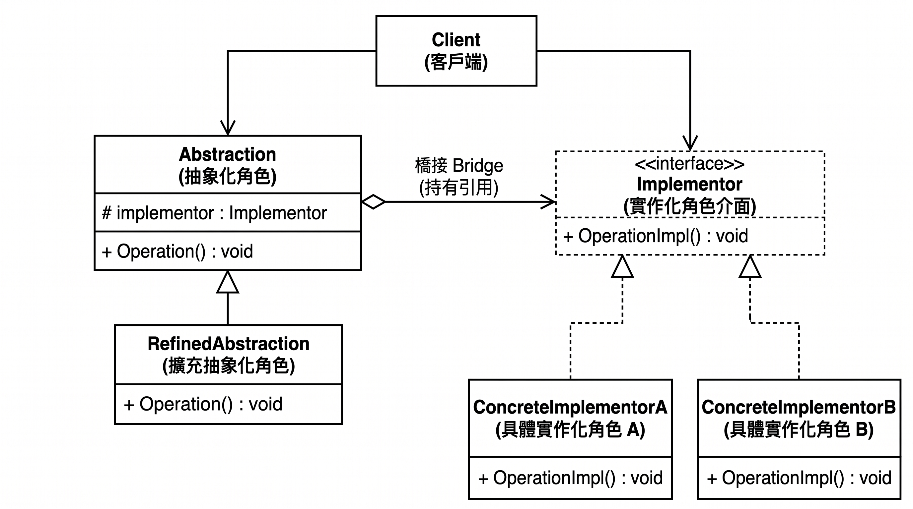
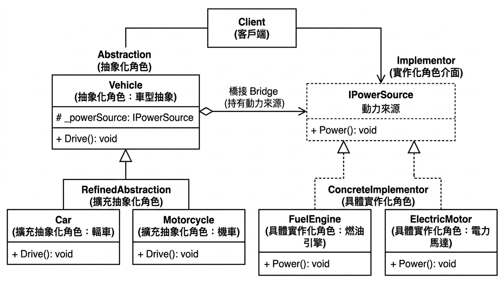

# Day 20｜Bridge——報表種類 vs 匯出格式，兩個維度分開

昨天用 Composite 把菜單分類整理成一棵樹，今天我們繼續留在結構型 Pattern（Structural），也是這個分類的最後一篇，來聊聊 Bridge 橋接模式

原文的定義，一樣來自 Design Patterns: Elements of Reusable Object-Oriented Software

> Decouple an abstraction from its implementation so that the two can vary independently.

用中文理解可以是

> 將抽象部分與其實作部分分離，讓兩者可以各自獨立變化

核心角色

1. Abstraction（抽象化角色）：定義高層次的操作，內部持有一個 Implementor 的參考，實際的實作細節委派出去，自己不碰
2. RefinedAbstraction（擴充抽象化角色）：Abstraction 的子類別，針對「抽象」這個維度做變化，但一樣是把實作委派給手上那個 Implementor
3. Implementor（實作化角色介面）：定義實作端該提供哪些操作，這層階層跟 Abstraction 那層完全分開，互不繼承
4. ConcreteImplementor（具體實作化角色）：真正把 Implementor 定義的操作做出來的類別

我們來看看 UML 會是什麼樣子


是不是覺得，每個單字我都認識，放在一起我就不認識了...沒關係朋友我也是

我看過許多人拿遙控器來解釋，那我們來換種方式好了

一間交通工具行，賣轎車、機車、貨車，一開始動力來源只有燃油引擎，車行開了一個共同的基底類別 `Vehicle`，每一種車各自繼承下去，用繼承表達完全沒問題

```csharp
public abstract class Vehicle
{
    public abstract void Drive();
}

public class FuelCar : Vehicle
{
    public override void Drive() => Console.WriteLine("轎車發動燃油引擎，上路");
}
public class FuelMotorcycle : Vehicle
{
    public override void Drive() => Console.WriteLine("機車發動燃油引擎，上路");
}
public class FuelTruck : Vehicle
{
    public override void Drive() => Console.WriteLine("貨車發動燃油引擎，上路");
}
```

後來公司決定跟上趨勢，同時推出電動版，車行的第一直覺，是繼續繼承同一個 `Vehicle`，幫每一種車再開一個對應的子類別

```csharp
public class ElectricCar : Vehicle
{
    public override void Drive() => Console.WriteLine("轎車啟動電動馬達，上路");
}
public class ElectricMotorcycle : Vehicle
{
    public override void Drive() => Console.WriteLine("機車啟動電動馬達，上路");
}
public class ElectricTruck : Vehicle
{
    public override void Drive() => Console.WriteLine("貨車啟動電動馬達，上路");
}
```

目前針對車型已經有 6 種類別，再過一陣子，油電混合的車款也要上市

同樣的事又要重演一次：又開`HybridCar`、`HybridMotorcycle`、`HybridTruck`

3 種車型 × 3 種動力來源，變成 9 個類別

而且只要「車型」或「動力來源」任何一邊再多一個新成員，另一邊有幾種既有值，就要對應補幾個新類別

**「車型」跟「動力來源」被寫死在同一個繼承階層裡**，但這兩件事明明各自獨立在變化(車型/動力來源)，卻被綁在一起，兩個維度的數量會互相相乘，讓類別數量呈指數成長、大量重複邏輯要分別維護

Bridge 的作法，是把這兩個維度拆開：

「車型」自己是一個階層（Abstraction 抽象化角色）

「動力來源」自己是另一個階層（Implementor 實作化角色介面）

車型不繼承動力來源，而是**持有**一個動力來源的參考

```csharp
// Implementor：動力來源該有的操作
public interface IPowerSource
{
    void Power();
}

// ConcreteImplementor：各種動力來源的具體實作
public class FuelEngine : IPowerSource // 燃油引擎 實作 Power()
{
    public void Power() => Console.WriteLine("發動燃油引擎");
}

public class ElectricMotor : IPowerSource  // 電力馬達 實作 Power()
{
    public void Power() => Console.WriteLine("啟動電動馬達");
}
```

```csharp
// Abstraction：車型，內部「 持有一個動力來源 」，不用去管動力怎麼實作
public abstract class Vehicle
{
    protected readonly IPowerSource _powerSource;

    protected Vehicle(IPowerSource powerSource)
    {
        _powerSource = powerSource;
    }

    public abstract void Drive();
}

// RefinedAbstraction：具體車型，只定義「這種車開起來是什麼樣子」，動力怎麼來的委派給 _powerSource
public class Car : Vehicle
{
    public Car(IPowerSource powerSource) : base(powerSource) { }

    public override void Drive()
    {
        _powerSource.Power();
        Console.WriteLine("轎車上路");
    }
}

public class Motorcycle : Vehicle
{
    public Motorcycle(IPowerSource powerSource) : base(powerSource) { }

    public override void Drive()
    {
        _powerSource.Power();
        Console.WriteLine("機車上路");
    }
}
```

```csharp
var fuelCar = new Car(new FuelEngine());
fuelCar.Drive();
// 發動燃油引擎
// 轎車上路

var electricMotorcycle = new Motorcycle(new ElectricMotor());
electricMotorcycle.Drive();
// 啟動電動馬達
// 機車上路
```

現在車行要推出「油電混合」，只要新增一個 `HybridEngine : IPowerSource`

所有車型都能直接搭配使用，`Car`、`Motorcycle`

反過來，車行要推出「貨車」這個新車型，只要新增一個 `Truck : Vehicle`，也不用去動任動力來源的程式碼

兩個維度變成 3 + 3 種各自獨立擴充，不再是 3 × 3 種寫死的組合

還記得我們剛剛的 UML 圖嗎，接下來我們把角色給套進去


Abstraction 是 Vehicle，是「車型」這個階層裡最上面那個抽象層，它負責「持有 IPowerSource」這件事<BR>
RefineAbstraction 是 Car、Motorcycle ，是「車型」階層裡具體的那一層

--

ConcreteImplementor 是 FuelEngine，是「動力來源」的具體化實作角色: 引擎<BR>
Implementor 是 IPowerSource ，定義「動力來源」該有的操作

| Bridge 角色             | 對應到程式碼                  | 說明                                                                                                    |
| ----------------------- | ----------------------------- | ------------------------------------------------------------------------------------------------------- |
| **Abstraction**         | `Vehicle`（抽象類別）         | 「車型」階層的最上層，持有一個 `IPowerSource` 參考，自己不管動力怎麼實作                                |
| **RefinedAbstraction**  | `Car`、`Motorcycle`           | 「車型」階層底下的具體車型，繼承 `Vehicle`，只定義「這種車開起來的樣子」，動力邏輯委派給 `_powerSource` |
| **Implementor**         | `IPowerSource`（介面）        | 「動力來源」階層的最上層，定義動力該有的操作（`Power()`）                                               |
| **ConcreteImplementor** | `FuelEngine`、`ElectricMotor` | 「動力來源」階層底下的具體實作，真正把 `Power()` 做出來                                                 |

希望以上的舉例可以讓初識 Bridge 的人能有點理解

Bridge 解決的核心問題是：

一個東西身上，如果有兩個（或以上）會各自獨立變化的維度

用單一繼承階層把這些維度壓平、寫死成固定組合的子類別，只要任何一個維度增加新成員，類別數量就會跟著另一個維度的既有值相乘成長

Bridge 把這些維度拆成各自獨立的階層，車型持有一個動力來源的參考（用組合取代繼承），讓兩邊各自擴充、互不牽動

### 回到柴咖啡

柴咖啡營運模式順利之後，也開了第二家分店~~可喜可賀

小黑想更清楚掌握營運狀況，開始要阿柴生出各種報表

營業額報表、庫存報表、會員積分報表，而且不同人要看報表的方式也不一樣

小黑喜歡直接看 PDF，會計小姐姐要 Excel 對帳，系統之間互轉資料則要 CSV

## 先看看阿柴最初的版本

阿柴一開始也是先開一個共同的基底類別 `Report`，每一種報表搭配每一種格式，各自繼承出一個類別

```csharp
public abstract class Report
{
    public abstract void Generate();
}

public class SalesReportPdf : Report
{
    public override void Generate() => Console.WriteLine("產出 PDF 格式的營業額報表");
}
public class SalesReportExcel : Report
{
    public override void Generate() => Console.WriteLine("產出 Excel 格式的營業額報表");
}

public class InventoryReportExcel : Report
{
    public override void Generate() => Console.WriteLine("產出 Excel 格式的庫存報表");
}
```

小黑後來要求加上「會員積分報表」，阿柴比照辦理，又多開兩個類別，產初 PDF 跟 Excel

```csharp
public class MemberPointsReportPdf : Report
{
    public override void Generate() => Console.WriteLine("產出 PDF 格式的會員積分報表");
}
public class MemberPointsReportExcel : Report
{
    public override void Generate() => Console.WriteLine("產出 Excel 格式的會員積分報表");
}
```

假設未來 報表種類 跟 匯出格式 這兩個維度都還在增加，類別數量也會跟著一直往上疊

後來會計要求資料要能匯出 CSV 方便跟記帳系統對接

阿柴又得回頭幫每一種既有報表各補一個類別：`SalesReportCsv`、`InventoryReportCsv`、`MemberPointsReportCsv`，類別數量也跟著一次跳了一截

跟交通工具行的問題相同：**「報表種類」跟「匯出格式」被寫死在同一個繼承階層裡**

這兩件事各自獨立在變化，卻被綁在一起，類別數量隨兩個維度相乘成長

### Bridge 上場，那該怎麼拆呢

Implementor => 匯出格式的操作

ConcreteImplementor => 舉體實作化角色(實作匯出格式)

Abstraction => abstract 報表

RefinedAbstraction => 具體報表

阿柴把「匯出格式」拆成獨立的一個階層，「報表種類」不再繼承「匯出格式」，改成持有一個「匯出格式」的參考

```csharp
// Implementor：匯出格式該有的操作
public interface IExportFormat
{
    void Export(string content);
}

// ConcreteImplementor：各種匯出格式的具體實作
public class PdfExport : IExportFormat
{
    public void Export(string content) => Console.WriteLine($"以 PDF 格式匯出：{content}");
}

public class ExcelExport : IExportFormat
{
    public void Export(string content) => Console.WriteLine($"以 Excel 格式匯出：{content}");
}
```

```csharp
// Abstraction：報表，內部持有一個匯出格式，不用去管格式怎麼實作
public abstract class Report
{
    protected readonly IExportFormat _exportFormat;

    protected Report(IExportFormat exportFormat)
    {
        _exportFormat = exportFormat;
    }

    public abstract void Generate();
}

// RefinedAbstraction：具體報表，只定義「這份報表的內容是什麼」，格式委派給 _exportFormat
public class SalesReport : Report
{
    public SalesReport(IExportFormat exportFormat) : base(exportFormat) { }

    public override void Generate()
    {
        _exportFormat.Export("本月營業額統計");
    }
}

public class InventoryReport : Report
{
    public InventoryReport(IExportFormat exportFormat) : base(exportFormat) { }

    public override void Generate()
    {
        _exportFormat.Export("目前庫存明細");
    }
}

public class MemberPointsReport : Report
{
    public MemberPointsReport(IExportFormat exportFormat) : base(exportFormat) { }

    public override void Generate()
    {
        _exportFormat.Export("會員積分清單");
    }
}
```

```csharp
var salesReportPdf = new SalesReport(new PdfExport());
salesReportPdf.Generate();
// 以 PDF 格式匯出：本月營業額統計

var inventoryReportExcel = new InventoryReport(new ExcelExport());
inventoryReportExcel.Generate();
// 以 Excel 格式匯出：目前庫存明細
```

會計要求的 CSV，只要新增一個 `CsvExport : IExportFormat`，各式報表都能搭配使用，

```csharp
public class CsvExport : IExportFormat
{
    public void Export(string content) => Console.WriteLine($"以 CSV 格式匯出：{content}");
}
```

```csharp
var salesReportCsv = new SalesReport(new CsvExport());
salesReportCsv.Generate();
// 以 CSV 格式匯出：本月營業額統計
```

反過來，之後要加新報表（例如「分店比較報表」），只要新增一個 `BranchComparisonReport : Report`，也不用去動 `IExportFormat` 的實作

「 兩個維度變成各自獨立擴充，不再是寫死的組合 」

### 今天學到的事

Bridge 要解決的問題：

`一個物件身上有兩個（或以上）會各自獨立變化的維度，若用單一繼承階層同時表達，子類數量會隨著維度數量相乘成長，任一維度新增成員，都要對另一維度的每個既有值各補一個類別`

**優點**：

- 兩個維度可以獨立擴充、各自變化，互不牽動，不會因為一邊新增成員就要連帶改動另一邊的程式碼
- 類別數量從「相乘」變成「相加」，避免繼承階層因為多維度組合而指數成長
- 兩個維度都可以在執行期自由搭配、抽換，不需要為每一種組合預先寫死一個類別

**缺點**：

- 多了一層間接（Abstraction 持有 Implementor 參考），多一次委派呼叫，追蹤程式碼路徑的成本會增加
- 如果這兩個維度實際上沒有真正各自獨立變化（例如某些組合根本不會出現、兩者其實高度耦合），硬拆成兩個階層只是徒增複雜度，換不到對應的彈性

---

明天來為結構型 Pattern 做個總結，順便補聊聊沒有獨立一篇的 **Flyweight** 享元模式

### 延伸閱讀資料

[Refactoring Guru - Bridge](https://refactoring.guru/design-patterns/bridge)

[Design Pattern: Structural Patterns — Bridge Pattern (橋接模式)](https://medium.com/bucketing/structural-patterns-bridge-pattern-e06e4de5045c)

[橋接模式(Bridge Pattern)](https://hackmd.io/@CityChen/B13UxfXaK)

[[Design Pattern] Bridge 橋樑模式](https://ithelp.ithome.com.tw/m/articles/10223861)
