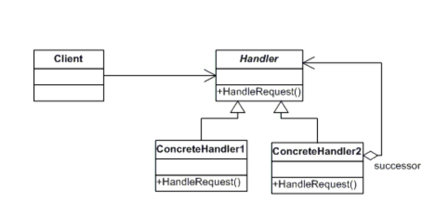

# Day 27｜責任鏈 Chain of Responsibility，客訴一棒接一棒，誰能處理誰接手

昨天用 State 把訂單的狀態機拆成物件，讓「現在能不能做這件事」交給狀態自己決定

今天要處理的是另一種常見的情境：一個請求進來，不知道最後會是誰處理，只知道「先讓某個人看看，他不能處理就換下一個人看」

原文的定義，來自 Design Patterns: Elements of Reusable Object-Oriented Software

> Avoid coupling the sender of a request to its receiver by giving more than one object a chance to handle the request. Chain the receiving objects and pass the request along the chain until an object handles it.

用中文理解可以是

> 避免把請求的發送者和接收者綁在一起，讓多個物件都有機會處理同一個請求。把這些物件串成一條鏈，讓請求沿著鏈往下傳，直到有物件願意處理它為止

我們來看看 UML



核心角色

1. **Handler（處理者介面）**：定義處理請求的方法，通常也會提供「設定下一個處理者」的方法
2. **ConcreteHandler（具體處理者）**：實作「這個請求我能不能處理」的判斷，能處理就處理掉、不能處理就轉交給下一位
3. **Client（客戶端）**：把整條鏈組好，然後只需要把請求丟給鏈的第一棒，不用知道後面實際上是誰接手

舉個生活化的例子，公司的請假簽核，依請假天數不同，會由不同層級的主管核准

- 3 天以內：組長就能核准
- 超過 3 天、7 天以內：組長權限不夠，要送到經理
- 超過 7 天：經理也不能核准，要送到人資

員工遞出去的請假單，並不知道最後會是誰核准，只知道先送給組長

```csharp
public interface IApprover // Handler 處理者介面
{
    IApprover SetNext(IApprover next); // 設定下一位，並回傳下一位方便串接
    void Approve(LeaveRequest request);
}

public class LeaveRequest
{
    public string EmployeeName { get; set; }
    public int Days { get; set; }
}


```

```csharp
public class TeamLeadApprover : IApprover  // 組長 ConcreteHandler（具體處理者）
{
    private IApprover _next;

    public IApprover SetNext(IApprover next)
    {
        _next = next;
        return next;
    }

    public void Approve(LeaveRequest request)
    {
        if (request.Days <= 3)
            Console.WriteLine($"[組長] 核准 {request.EmployeeName} 請假 {request.Days} 天");
        else
            _next?.Approve(request); // 天數超過權限，交給下一位
    }
}

public class ManagerApprover : IApprover       // 經理
{
    private IApprover _next;

    public IApprover SetNext(IApprover next)
    {
        _next = next;
        return next;
    }

    public void Approve(LeaveRequest request)
    {
        if (request.Days <= 7)
            Console.WriteLine($"[經理] 核准 {request.EmployeeName} 請假 {request.Days} 天");
        else
            _next?.Approve(request);
    }
}

public class HRApprover : IApprover            // 人資，鏈尾，全部核准
{
    public IApprover SetNext(IApprover next) => next;

    public void Approve(LeaveRequest request)
        => Console.WriteLine($"[人資] 核准 {request.EmployeeName} 請假 {request.Days} 天");
}
```

```csharp
var teamLead = new TeamLeadApprover();
var manager = new ManagerApprover();
var hr = new HRApprover();

teamLead.SetNext(manager).SetNext(hr); // 組長 → 經理 → 人資

teamLead.Approve(new LeaveRequest { EmployeeName = "小明", Days = 2 });  // [組長] 核准 小明 請假 2 天
teamLead.Approve(new LeaveRequest { EmployeeName = "小華", Days = 5 });  // [經理] 核准 小華 請假 5 天
teamLead.Approve(new LeaveRequest { EmployeeName = "小美", Days = 10 }); // [人資] 核准 小美 請假 10 天
```

來釐清一下整個過程，呼叫的入口是 `teamLead.Approve(request)`，所以每一筆請假單都是先經過組長:

1. teamLead.Approve(...) 被呼叫，TeamLeadApprover 檢查 request.Days <= 3
   - 是 → 自己核准，結束
   - 否 → 呼叫 \_next.Approve(request)，轉交給 manager
2. 如果轉到 manager,ManagerApprover 檢查 request.Days <= 7
   - 是 → 自己核准,結束
   - 否 → 呼叫 \_next.Approve(request)，轉給 hr
3. 轉到 hr 是鏈尾，直接核准，不會再往下傳

不管請假天數是多少，員工永遠只找組長遞假單，`teamLead.Approve(...)` 這一行程式碼不用變，天數該給誰核准，是每一位 Approver 自己判斷、自己決定要不要往下傳的事

### 回到柴咖啡

柴咖啡連鎖化之後，客訴量早就不是店員一個人扛得住的規模，而且不同客訴的嚴重程度差很多

有些是「飲料太甜、退一杯的錢就沒事」，有些是「飲料裡喝到異物」，屬於食安層級，不是退錢能打發的事

阿柴這次直接照店內三個角色的權責範圍設計責任鏈

- **店員**：只處理小額退款、非食安問題（例如退款金額在 100 元以內）
- **店長**：店員權限不夠的就往上交，處理中額退款、非食安問題（例如 500 元以內）
- **客服中心**：鏈尾，兜底兩種情況: 一種是金額超過店長權限，另一種是只要牽涉食安問題，不管金額多小，一律跳過前兩棒直接送到這裡

### 用 Chain of Responsibility 設計客訴處理

先定義客訴這個請求本身，跟處理者共同的介面

```csharp
public class Complaint
{
    public string OrderId { get; set; }
    public int RefundAmount { get; set; }
    public bool IsFoodSafetyIssue { get; set; }
    public string Description { get; set; }
}

public interface IComplaintHandler
{
    IComplaintHandler SetNext(IComplaintHandler next);
    void Handle(Complaint complaint);
}
```

店員、店長各自守住自己的權限範圍，接不住的往下一棒傳

```csharp
public class StaffHandler : IComplaintHandler // 店員
{
    private IComplaintHandler _next;

    public IComplaintHandler SetNext(IComplaintHandler next)
    {
        _next = next;
        return next;
    }

    public void Handle(Complaint complaint)
    {
        if (!complaint.IsFoodSafetyIssue && complaint.RefundAmount <= 100)
            Console.WriteLine($"[店員] 受理訂單 {complaint.OrderId}，退款 {complaint.RefundAmount} 元");
        else
            _next?.Handle(complaint);
    }
}

public class StoreManagerHandler : IComplaintHandler // 店長
{
    private IComplaintHandler _next;

    public IComplaintHandler SetNext(IComplaintHandler next)
    {
        _next = next;
        return next;
    }

    public void Handle(Complaint complaint)
    {
        if (!complaint.IsFoodSafetyIssue && complaint.RefundAmount <= 500)
            Console.WriteLine($"[店長] 受理訂單 {complaint.OrderId}，退款 {complaint.RefundAmount} 元");
        else
            _next?.Handle(complaint);
    }
}
```

客服中心是鏈尾，兩種情況都會落到這裡；核准退款時，不重新發明一套退款邏輯，而是沿用 Day 24 已經做好的 `RefundCommand`、丟進 `SupportConsole` 去執行，客訴退款一樣享有撤銷/重做的能力

```csharp
public class HeadquartersComplaintHandler : IComplaintHandler // 客服中心，鏈尾
{
    private readonly SupportConsole _supportConsole;
    private readonly PaymentGateway _paymentGateway;

    public HeadquartersComplaintHandler(SupportConsole supportConsole, PaymentGateway paymentGateway)
    {
        _supportConsole = supportConsole;
        _paymentGateway = paymentGateway;
    }

    public IComplaintHandler SetNext(IComplaintHandler next) => next; // 鏈尾，沒有下一棒了

    public void Handle(Complaint complaint)
    {
        var reason = complaint.IsFoodSafetyIssue ? "食安問題，另外走通報流程" : "退款金額超過店長權限";
        Console.WriteLine($"[客服中心] 受理訂單 {complaint.OrderId}（{reason}）");

        _supportConsole.ExecuteCommand(new RefundCommand(_paymentGateway, complaint.OrderId, complaint.RefundAmount));
    }
}
```

```csharp
var supportConsole = new SupportConsole();
var paymentGateway = new PaymentGateway();

IComplaintHandler staff = new StaffHandler();
IComplaintHandler manager = new StoreManagerHandler();
IComplaintHandler headquarters = new HeadquartersComplaintHandler(supportConsole, paymentGateway);

staff.SetNext(manager).SetNext(headquarters); // 店員 → 店長 → 客服中心

客訴一 :
staff.Handle(new Complaint { OrderId = "ORD2001", RefundAmount = 50, Description = "飲料太甜" });
// [店員] 受理訂單 ORD2001，退款 50 元

客訴二 :
staff.Handle(new Complaint { OrderId = "ORD2002", RefundAmount = 300, Description = "少了燕麥奶加購" });
// 店員接不住 → [店長] 受理訂單 ORD2002，退款 300 元

客訴三 :
staff.Handle(new Complaint { OrderId = "ORD2003", RefundAmount = 20, IsFoodSafetyIssue = true, Description = "飲料裡有異物" });
// 金額很小，但食安問題直接跳過店員、店長 → [客服中心] 受理訂單 ORD2003（食安問題，另外走通報流程），並執行 RefundCommand
```

呼叫端只會找 `staff.Handle(complaint)`，這個客訴最後會落在誰手上、要不要真的退款，都是處理者自己的事，跟 Day 24 建立的退款/補償機制接起來後，也不用重新煩惱「這筆退款怎麼執行、能不能撤銷」這件事

### 責任鏈的取捨

如果處理層級只有一兩層、規則長期不太會變（例如只有「店員／總部」兩層，而且金額門檻幾乎不會調整），拆成好幾個 Handler 類別，可能比一段簡單的 if-else 更麻煩

責任鏈划算的情境，是處理層級數量多、判斷規則之後還會持續增加或調整，而且希望能在執行期動態組裝、調整鏈的順序，而不是寫死在一段條件式裡

它也有自己的代價：

- 鏈一長，除錯時得一路追過去才知道最後是誰接手的，不容易一眼看出完整的處理流程
- 如果鏈尾也不處理、又沒有額外的保底機制，請求可能被默默吞掉、沒人發現
- 組鏈的順序（`SetNext` 呼叫的先後）本身變成一種隱性規則，順序調換就會改變行為，卻不會有編譯期的錯誤提醒你

### 今天學到的事

Chain of Responsibility 要解決的問題：

`一個請求可能需要被多個候選者依序檢查是否要處理，若把所有判斷邏輯寫成一長串 if-else 集中在一處，新增或調整處理規則時，順序與條件會彼此牽動、容易顧此失彼`

**優點**：

- 請求發送方跟實際處理者解耦：呼叫端只需要把請求交給鏈的第一棒，不用知道鏈有多長、最後是誰接手
- 擴充符合 OCP：新增一個處理層級只需要新增一個 Handler、接進鏈裡，不需要更動既有處理者的判斷邏輯
- 每個處理者職責單一：只專心回答「這種情況我能不能處理」，好理解也好測試

**缺點**：

- 鏈太長時難以一眼看穿完整流程，除錯要一路追下去
- 沒有處理者接手、又沒設計保底機制時，請求可能被默默漏接
- 組鏈順序是隱性規則，寫錯順序不會編譯錯誤，只會在執行期得到錯的結果

---

明天，柴咖啡的訂單，牽涉到廚房、收銀、外送平台三個角色互相通知，如果讓它們互相直接呼叫對方，任何一個角色要換掉都會牽動所有跟它有往來的角色，換 **Mediator** 中介者模式上場，讓一個訂單協調員居中協調

## 參考資料

[Refactoring Guru - Chain of Responsibility](https://refactoring.guru/design-patterns/chain-of-responsibility)

[C# Chain of Responsibility Design Pattern](https://www.dofactory.com/net/chain-of-responsibility-design-pattern)
