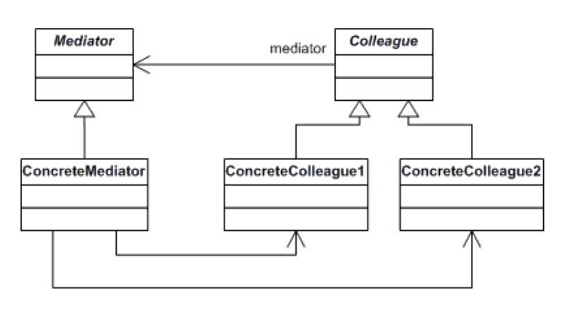

# Day 28｜中介者 Mediator，廚房、收銀、外送平台不再互相打電話，交給一個居中協調的窗口

昨天用 Chain of Responsibility 把客訴依照店員、店長、客服中心的權限逐層上交

今天要處理的，是柴咖啡訂單背後另一種常見的情境：好幾個角色都會參與同一件事，任何一個角色動作，常常需要同時知會另外幾個

原文的定義，來自 Design Patterns: Elements of Reusable Object-Oriented Software

> Define an object that encapsulates how a set of objects interact. Mediator promotes loose coupling by keeping objects from referring to each other explicitly, and it lets you vary their interaction independently.

用中文理解可以是

> 定義一個物件來封裝一群物件之間如何互動。中介者讓物件之間不需要顯式地持有彼此的參照，藉此促成鬆散耦合，並讓這些物件之間的互動方式可以獨立變化

我們來看看 UML 圖



核心角色

1. **Mediator（中介者介面）**：定義同事物件之間溝通時需要用到的方法
2. **ConcreteMediator（具體中介者）**：實作 Mediator 介面，掌握所有同事物件的參考，統籌它們之間的互動邏輯
3. **Colleague（同事類別）**：只認識 Mediator 介面，有事要溝通就透過它轉達，不直接持有其他同事的參考
4. **ConcreteColleague（具體同事類別）**：實際會觸發事件、或需要被通知的物件

以前很嚮往在塔台工作，那我們來舉機場的塔台的例子好了


飛機要起飛降落，不會自己跑去跟其他飛機通話喬順序(一定會撞機)

全部都透過塔台居中調度，哪天多開一條跑道、或少一架飛機在天上盤旋，其他飛機的邏輯完全不用跟著改

```csharp
// 1. Mediator（中介者介面）
public interface IControlTower
{
    void RequestLanding(Aircraft aircraft);
    void NotifyLanded(Aircraft aircraft);
}

// 3. Colleague（同事類別）：只認識塔台，不認識其他飛機
public class Aircraft // 飛機
{
    public string FlightNumber { get; }
    private readonly IControlTower _tower;

    public Aircraft(string flightNumber, IControlTower tower)
    {
        FlightNumber = flightNumber;
        _tower = tower;
    }

    public void RequestLanding() => _tower.RequestLanding(this); // 有事只找塔台，不會直接聯絡別架飛機
    public void Land() => _tower.NotifyLanded(this);
}

// 2. ConcreteMediator（具體中介者）
public class ControlTower : IControlTower // 塔台
{
    private Aircraft _landingAircraft; // 目前佔用跑道的飛機

    public void RequestLanding(Aircraft aircraft)
    {
        if (_landingAircraft == null)
        {
            Console.WriteLine($"[塔台] 同意 {aircraft.FlightNumber} 降落");
            _landingAircraft = aircraft; // 標記跑道佔用中，還沒有降落
        }
        else
        {
            Console.WriteLine($"[塔台] 跑道使用中，{aircraft.FlightNumber} 請盤旋等待");
        }
    }

    public void NotifyLanded(Aircraft aircraft)
    {
        Console.WriteLine($"[塔台] {aircraft.FlightNumber} 已降落，跑道淨空");
        _landingAircraft = null;
    }
}
```

```csharp
var tower = new ControlTower();
var flightA = new Aircraft("CI-101", tower);
var flightB = new Aircraft("BR-202", tower);

flightA.RequestLanding();
// [塔台] 同意 CI-101 降落

flightB.RequestLanding(); // CI-101 還佔著跑道，還沒降落完畢
// [塔台] 跑道使用中，BR-202 請盤旋等待

flightA.Land(); // CI-101 落地
// [塔台] CI-101 已降落，跑道淨空

flightB.RequestLanding(); // 跑道淨空了，這次才會被同意
// [塔台] 同意 BR-202 降落
```

`Aircraft` 從頭到尾不知道天上還有哪些飛機，也不需要知道

它只知道塔台這一個窗口，該不該降落、什麼時候降落，全部交給塔台判斷

### Mediator 的精神

`Aircraft(同事類別)` 只認識 `IControlTower` 這個介面，呼叫它、把自己傳過去

至於協調邏輯(誰先降落、誰要等待)不歸 Aircraft 管，全部收斂在 `ControlTower(中介者)` 這一個地方

### 回到柴咖啡

柴咖啡的訂單，現在牽涉三個原本各自獨立運作的角色：

1. 廚房負責出餐
2. 收銀負責開立取餐憑證與退款
3. 外送平台負責派人取貨（或是客人臨時取消）

這三個角色一開始各自管好自己的事，但訂單狀態一有變化，其中一個角色的動作，常常需要同時知會另外兩個

出餐完成時，廚房不只要把飲料放上出餐檯，還得讓收銀知道可以列印取餐憑證了、讓外送平台知道這張單可以派人來取貨了

反過來，外送平台上如果客人臨時取消，也得讓廚房停止製作、讓收銀執行退款

如果讓廚房、收銀、外送平台這三個角色互相直接持有對方的參照、直接呼叫對方的方法，任何一個角色的介面或行為一改

另外兩個跟它有往來的角色就得跟著改

三個角色兩兩之間都可能存在呼叫關係，這種關係數量會隨著角色增加而快速膨脹，以後小黑想再加一個「會員點數同步」的通知對象，又得回頭在好幾個角色裡到處插入新的呼叫

阿柴這次決定不讓這三個角色互相認識，而是統一透過一個訂單協調員（`OrderCoordinator`）居中溝通，任何角色有動作，只需要通知協調員，協調員自己知道該去知會誰

### 用 Mediator 設計訂單協調員

先定義協調員需要處理的兩種情境

```csharp
public interface IOrderMediator // Mediator 介面
{
    void NotifyOrderReady(string orderId);     // 廚房出餐完成
    void NotifyOrderCancelled(string orderId); // 外送平台端被取消
}
```

廚房、收銀、外送平台都改成只認識 `IOrderMediator`，有事發生時只通知協調員，不直接呼叫另外兩個角色

```csharp
public class KitchenService // Colleague 1: 廚房
{
    private IOrderMediator _mediator;

    public void SetMediator(IOrderMediator mediator) => _mediator = mediator;

    public void ReceiveOrder(Order order)
        => Console.WriteLine($"[廚房] 收到訂單 {order.OrderId}，開始製作");

    public void FinishPreparing(string orderId) // 出餐完成，只通知協調員，不知道誰會收到
    {
        Console.WriteLine($"[廚房] 訂單 {orderId} 出餐完成");
        _mediator.NotifyOrderReady(orderId);
    }

    public void StopPreparing(string orderId) // 收到協調員通知才停止製作
        => Console.WriteLine($"[廚房] 訂單 {orderId} 停止製作");
}

public class CashierService // Colleague，新引入的收銀端服務
{
    private IOrderMediator _mediator;

    public void SetMediator(IOrderMediator mediator) => _mediator = mediator;

    public void PrintPickupReceipt(string orderId)
        => Console.WriteLine($"[收銀] 列印訂單 {orderId} 取餐憑證");

    public void Refund(string orderId)
        => Console.WriteLine($"[收銀] 訂單 {orderId} 退款完成");
}
```

外送平台這端要負責的是「把狀態推播出去、把客人的取消動作回報進來」

```csharp
public interface IDeliveryPlatformGateway // Colleague 介面
{
    void SetMediator(IOrderMediator mediator);
    void NotifyReadyForPickup(string orderId);
    void CustomerCancelOrder(string orderId); // 客人在平台上取消，由這裡觸發
}

public class QberEatsGateway : IDeliveryPlatformGateway
{
    private IOrderMediator _mediator;

    public void SetMediator(IOrderMediator mediator) => _mediator = mediator;

    public void NotifyReadyForPickup(string orderId)
        => Console.WriteLine($"[Qber Eats] 訂單 {orderId} 狀態更新為可取貨");

    public void CustomerCancelOrder(string orderId)
    {
        Console.WriteLine($"[Qber Eats] 客人取消訂單 {orderId}");
        _mediator.NotifyOrderCancelled(orderId);
    }
}

public class FoodDogGateway : IDeliveryPlatformGateway
{
    private IOrderMediator _mediator;

    public void SetMediator(IOrderMediator mediator) => _mediator = mediator;

    public void NotifyReadyForPickup(string orderId)
        => Console.WriteLine($"[foodDog] 訂單 {orderId} 狀態更新為可取貨");

    public void CustomerCancelOrder(string orderId)
    {
        Console.WriteLine($"[foodDog] 客人取消訂單 {orderId}");
        _mediator.NotifyOrderCancelled(orderId);
    }
}
```

最後才是真正的主角，`OrderCoordinator`，持有三方的參考，決定「誰觸發了什麼事，該去通知誰」

```csharp
public class OrderCoordinator : IOrderMediator // ConcreteMediator
{
    private readonly KitchenService _kitchen;
    private readonly CashierService _cashier;
    private readonly IDeliveryPlatformGateway _platform;

    public OrderCoordinator(KitchenService kitchen, CashierService cashier, IDeliveryPlatformGateway platform)
    {
        _kitchen = kitchen;
        _cashier = cashier;
        _platform = platform;

        _kitchen.SetMediator(this);
        _cashier.SetMediator(this);
        _platform.SetMediator(this);
    }

    public void NotifyOrderReady(string orderId) // 廚房出餐完成 → 通知收銀 + 外送平台
    {
        _cashier.PrintPickupReceipt(orderId);
        _platform.NotifyReadyForPickup(orderId);
    }

    public void NotifyOrderCancelled(string orderId) // 外送平台取消 → 通知廚房 + 收銀
    {
        _kitchen.StopPreparing(orderId);
        _cashier.Refund(orderId);
    }
}
```

實際跑起來，看兩種情境各自會觸發什麼連鎖反應

```csharp
var kitchen = new KitchenService();
var cashier = new CashierService();
var qberEats = new QberEatsGateway();

var coordinator = new OrderCoordinator(kitchen, cashier, qberEats);

kitchen.FinishPreparing("ORD3001");
// [廚房] 訂單 ORD3001 出餐完成
// [收銀] 列印訂單 ORD3001 取餐憑證
// [Qber Eats] 訂單 ORD3001 狀態更新為可取貨

qberEats.CustomerCancelOrder("ORD3002");
// [Qber Eats] 客人取消訂單 ORD3002
// [廚房] 訂單 ORD3002 停止製作
// [收銀] 訂單 ORD3002 退款完成
```

透過 mermaid 展示流程圖，大概像這樣


`kitchen.FinishPreparing(...)` 不知道最後是誰收到通知，`qberEats.CustomerCancelOrder(...)` 也不知道；它們都只是把發生的事告訴 `_mediator`，該通知誰、通知順序是什麼，全部是 `OrderCoordinator` 自己決定的事

哪天小黑想再加一個「會員點數同步」，只需要在 `OrderCoordinator` 裡多注入一個依賴、在對應的方法裡多呼叫一行，`KitchenService`、`CashierService`、平台端的程式碼完全不用動——它們從頭到尾都只認識 `IOrderMediator` 這個介面

### 跟 Observer 有什麼不同?

Day 23 的 Observer，是一個 Subject 對多個 Observer 的**單向廣播**：`Order` 完成時只會往外通知，`CustomerNotifier`、`DeliveryPlatformSyncer` 不會反過來影響 `Order` 本身，彼此之間也不會互相通知，誰是發送方永遠是固定的

今天的情境不一樣，廚房、收銀、外送平台是互為觸發來源、互為通知對象：廚房出餐完成要通知另外兩個角色，外送平台取消訂單一樣要通知另外兩個角色，誰是發送方、誰是接收方，會隨著事件而互換。這種**多方互相協調**的情境，用一個中心化的中介者統一調度，會比每個角色各自維護一份「該通知誰」的訂閱清單更清楚

### Mediator 的取捨

如果同事物件之間的互動很單純、只有兩三個物件、規則長期不太會變，直接讓它們互相持有參照呼叫，可能比額外包一層中介者更省事

Mediator 划算的情境，是同事物件數量多、彼此的互動規則複雜，而且預期還會持續增加新的同事或新的協調規則

它也有自己的代價：

- 中介者很容易演變成一個什麼都知道的「上帝物件」，所有協調邏輯都集中在這一個類別裡，中介者本身反而變成最難維護、最容易一改就牽連整個系統的地方
- 同事物件之間原本清楚的直接呼叫關係，被中介者的間接呼叫取代後，要追蹤「這個動作最後觸發了什麼」，得繞去中介者裡才看得到全貌
- 中介者若沒設計好，容易把不相關的協調邏輯全部塞進同一個類別，反而違反單一職責

### 今天學到的事

Mediator 要解決的問題：

`多個物件之間需要互相溝通協調，若讓它們彼此直接持有參照、互相呼叫，物件之間會形成複雜的網狀依賴，任何一個物件的介面或行為改變，都會牽動所有跟它有往來的物件`

**優點**：

- 物件之間解耦：同事物件只需要認識中介者介面，不需要知道其他同事物件的存在，也不用持有對方的參照
- 集中管理互動邏輯：協調規則全部收斂在中介者裡，不用散落在每個同事物件內部各自判斷
- 擴充新的同事或新的協調規則，通常只需要修改中介者，不需要動到既有同事物件的程式碼

**缺點**：

- 中介者容易演變成掌握過多邏輯的上帝物件，複雜度全部往中介者集中
- 間接呼叫取代了原本直接的呼叫關係，追蹤一個動作最終觸發了哪些後續反應，得繞去中介者裡才看得到全貌
- 同事物件數量或協調規則其實很單純時，多包一層中介者反而增加不必要的間接層

---

明天，30 天只剩最後兩篇，先來聊這個系列最後一個新 Pattern：Iterator，看柴咖啡的菜單樹要怎麼在不暴露內部結構的前提下，被一次走訪完

### 參考資料

[Refactoring Guru - Mediator](https://refactoring.guru/design-patterns/mediator)

[C# Mediator Design Pattern](https://www.dofactory.com/net/mediator-design-pattern)
